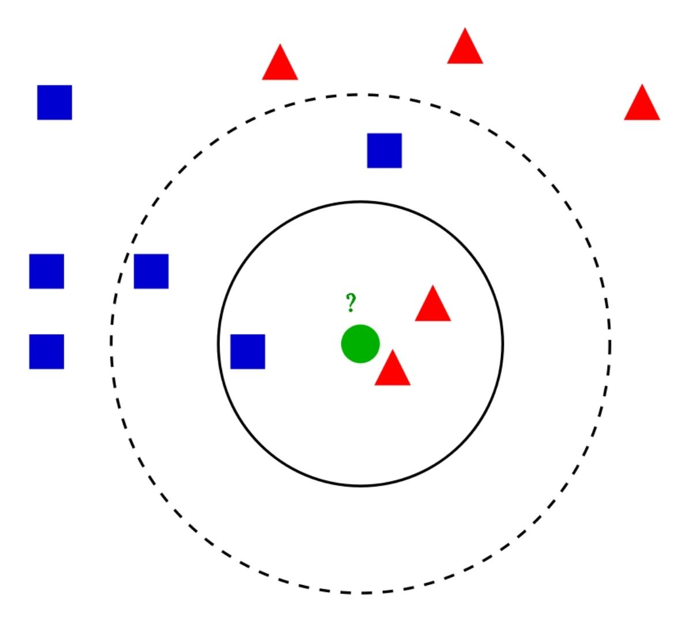
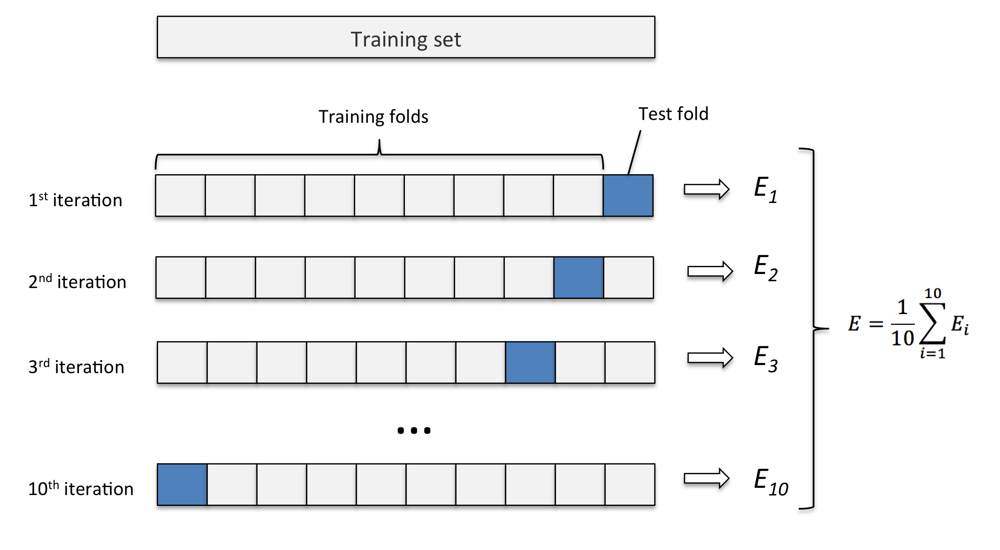

# k-Nearest Neighbors (KNN) e k-Fold

[](https://svgshare.com/i/Zhy.svg)
[](https://jdk.java.net/)

> ⚠️ Implementação em **java** do algoritmo **KNN** para classificação, combinado ao **k-fold** para validação cruzada.

## Overview

O classificador dos **k vizinhos mais próximos (k-NN)** se encaixa em uma categoria de algoritmos conhecida como aprendizado preguiçoso (_lazy-learning_), que consiste em atrasar o processo de indução ou generalização até o momento em que a classificação é executada. Esse método se baseia no princípio de que objetos que possuem propriedades similares estarão localizados mais próximos dentro de um espaço multidimensional. Deste modo, para classificar uma amostra, basta verificar a classe dos vizinhos mais próximos. A proximidade entre os padrões é dada por uma métrica de similaridade, como por exemplo a **distância euclidiana**.

Dado um padrão desconhecido **_X_**, a classificação é feita da seguinte maneira:

1. Calcular a distância entre **_X_** e todos os outros objetos do conjunto de treinamento.
2. Verificar as classes dos **_k_** vizinhos mais próximos.
3. Selecionar entre as classes verificadas, a que possui maior frequência.
4. Se houver empate, decrementar o valor de **_k_** e voltar para o passo 2.
5. Rotular **_X_** com a classe selecionada.



Já a validação cruzada (_Cross-Validation_) e um procedimento de reamostragem usado para avaliar modelos de aprendizado de máquina em uma amostra de dados limitada. O **k-Fold** tem um único parâmetro chamado **k** que se refere ao número de partições em que uma determinada amostra de dados deve ser dividida.

Dado o valor de **_k_**, o procedimento de validação é feito da seguinte maneira:

1. Embaralhar o dataset.
2. Dividir o dataset em **_k_** grupos.
3. Para cada grupo:
   1. Separá-lo como conjunto de teste.
   2. Agrupar o resto dos dados como conjunto de treinamento.
   3. Treinar um novo modelo utilizando o conjunto de treino.
   4. Avaliar o modelo utilizando o conjunto de teste.
4. Calcular o desempenho final considerando as performances de todos os modelos obtidos.



## Instalação

Clone o repositório e compile o código utilizando o comando **javac**, de acordo com o exemplo:

```Bash
git clone https://github.com/eduardoatr/KNN_KF.git
cd KNN_KF
javac -d . classificador/*.java
```

## Execução

Para executar, basta utilizar o comando **java**, fornecendo como parâmetros o **caminho** para o arquivo contendo os dados para o treinamento, seguido dos valores de **k** para a quantidade de vizinhos do **kNN** e para o número de partições do **k-Fold**, como mostrado no exemplo a seguir:

```Bash
java classificador.Main "testes/dados_1.txt" 4 3
```

O arquivo de entrada contendo os dados deve apresentar em sua primeira linha dois inteiros: **N** indicando a quantidade de _objetos_ (linhas) a serem classificados e **M** a quantidade _features_ (colunas) que cada objeto possui. Cada um desses valores é separado por um espaço, como mostrado no exemplo a seguir:

```text
10 2
1.87 76.1 0
1.65 75.2 1
1.80 60.0 1
1.81 55.9 0
1.90 93.3 1
1.74 65.2 1
1.49 45.1 0
1.56 53.2 0
1.73 55.1 0
1.76 63.1 1
```

O diretório **_testes_** contém alguns exemplos de entradas.
